# Nhóm 12: Bổ sung lúc demo, show code

## 1. Logic chức năng

### 1.1 Dữ liệu gõ raw của client đi như thế nào?

Client gửi `TYPING_UPDATE` mỗi `300ms` lên server:

src/TypeRacer.Server/Handlers/RaceForm.cs
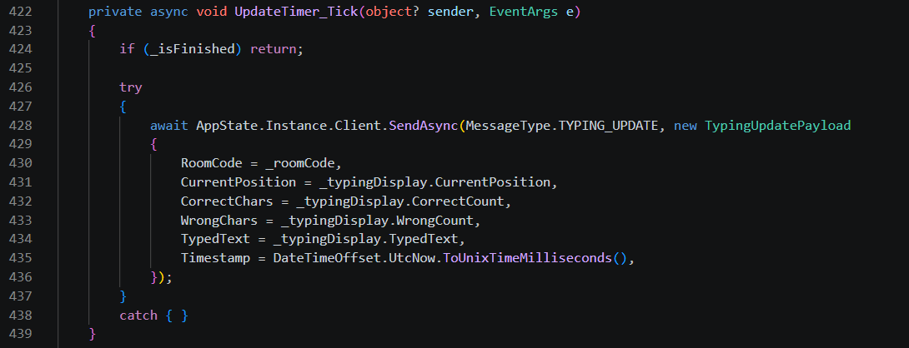

Trong payload có:

- `CurrentPosition`
- `CorrectChars`
- `WrongChars`
- `TypedText`
- `Timestamp`

Server nhận dữ liệu này ở:

src/TypeRacer.Server/Handlers/GameHandler.cs
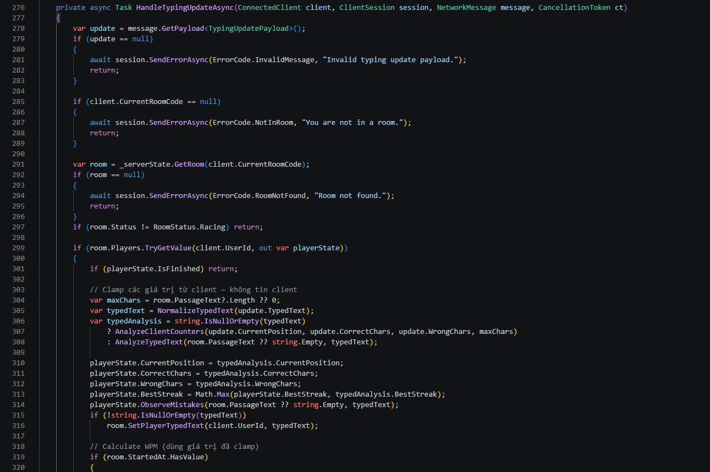

Các bước xử lý chính (Clamp):

- normalize text: (305)
- phân tích lại thay vì tin client: (306)
- ghi nhận lỗi realtime: (314)
- lưu typed text mới nhất: (316)

### 1.2 Dữ liệu lỗi raw dùng cho AI có thật không?

Hệ thống không chỉ dùng report cuối race, mà lấy cả lỗi quan sát trong lúc gõ:

src/TypeRacer.Server/State/GameRoom.cs
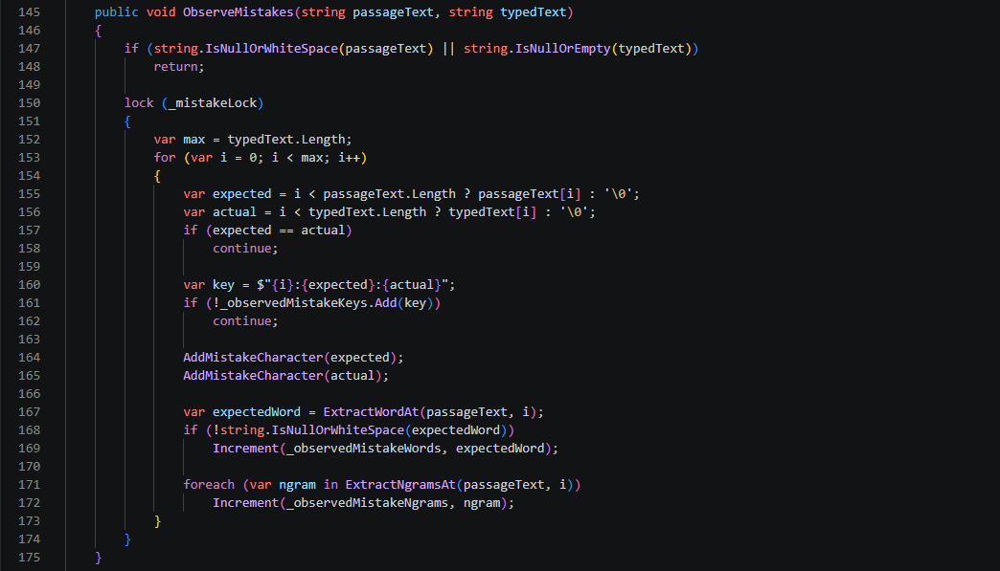

Ở đây server bắt:
- ký tự sai
- từ sai
- n-gram sai

Cuối race, server lưu vào volatile memory cho AI:

src/TypeRacer.Server/Services/MistakeMemoryService.cs
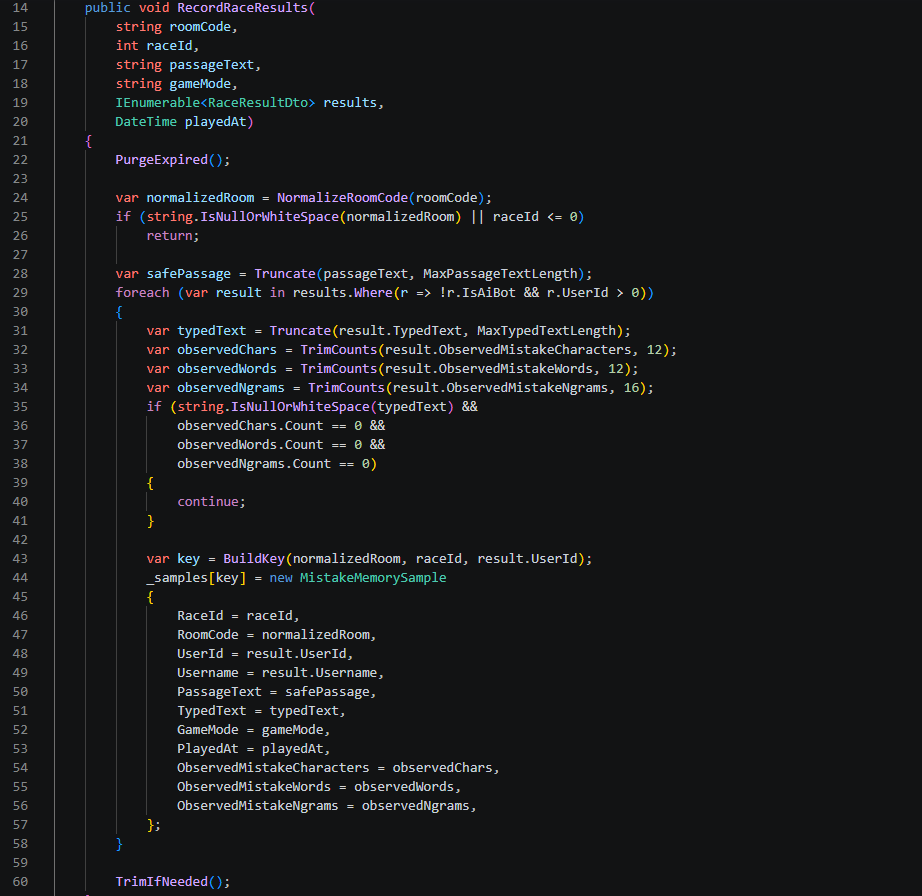

Các field lưu gồm:
- `PassageText`
- `TypedText`
- `ObservedMistakeCharacters`
- `ObservedMistakeWords`
- `ObservedMistakeNgrams`

### 1.3 AI lấy dữ liệu này như thế nào

Stats handler lấy sample lỗi rồi truyền vào AI. Prompt AI được build từ đúng dữ liệu đó:

src/TypeRacer.Server/Services/AiCoachService.cs
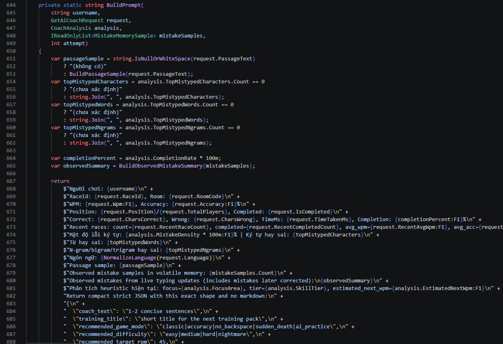

Phần chứng minh AI dựa vào lỗi thật:

- top mistake chars (dòng 654)
- top mistake words (dòng 657)
- top n-grams (dòng 660)
- observed summary từ volatile memory (dòng 665)

## 2. Làm việc với dữ liệu nhập xuất

### 2.1 Dùng I/O stream gì

Project dùng:

- `TcpClient` / `TcpListener`
- `NetworkStream`
- `ReadAsync` / `WriteAsync`

Code chính:

src/TypeRacer.Client/Network/TcpGameClient.cs
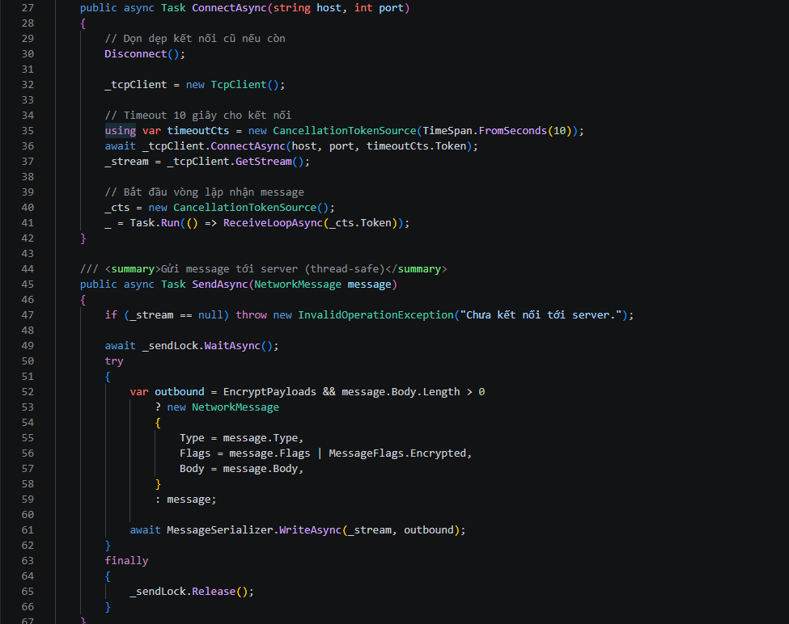
- client connect lấy stream:
- client gửi message
- server gửi message: (src/TypeRacer.Server/Network/ClientSession.cs:19)
- serializer ghi header + body (src/TypeRacer.Shared/Protocol/MessageSerializer.cs:12)
- reader đọc đủ byte từ TCP stream: (src/TypeRacer.Shared/Protocol/MessageReader.cs:11)


## 3. Mã hóa

### 3.1 Code mã hóa pass đăng kí/đăng nhập

src\TypeRacer.Server\Services\AuthService.cs
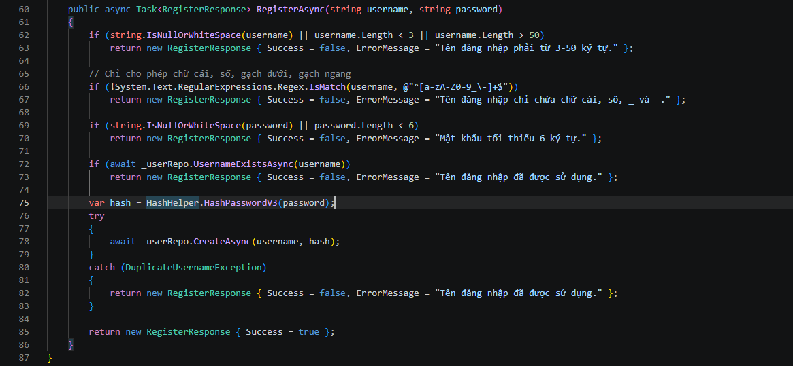
Auth service:
- verify password
- tạo session token
- hash password khi register
- HashHelper.HashPasswordV3() trong c# dùng `PBKDF2-HMAC-SHA256 + salt`

### 3.2 Bắt Wireshark đăng kí/đăng nhập xem có mã hóa không

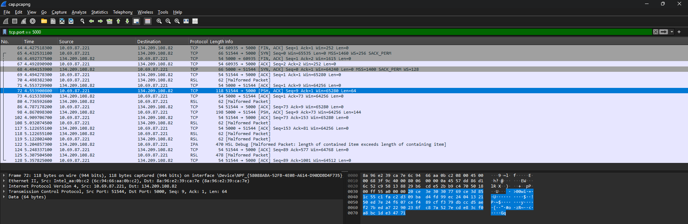

- Luồng đăng nhập là TCP stream 7: `10.69.87.221:51544 -> 134.209.108.82:5000`

- Protocol của app dùng header 8 byte: `[BodyLength:4][Type:2][Flags:2]`

1. Frame 70 là header của LOGIN_REQUEST

    - payload 8 byte: `00 00 00 40 00 64 00 01`

    - giải mã:
        - BodyLength = 0x00000040 = 64
        - Type = 0x0064 = 100 = LOGIN_REQUEST
        - Flags = 0x0001 = Encrypted

2. Frame 72 là body của LOGIN_REQUEST dài đúng 64 bytes
    ```
    20 ce 3e 30 30 77 69 ce 3d 85 1c 55 c1 fa c2 d3
    09 ba d4 fd 99 ec 24 04 13 21 50 ed 7e 24 f6 07
    ce f4 89 cf f3 79 db cc d5 ae f2 7b ed a7 22 90
    23 6f c8 7a 52 7e cd e8 3c f0 a8 bc 1d e3 47 71
    ```
    - phần này là ciphertext, không đọc được username/password dạng text hay JSON.

Kết luận: Body 64 byte ở Frame 72 là dữ liệu nhị phân ngẫu nhiên, không lộ username/password dưới dạng plain text.

### 3.3 Code mã hóa chat

- Client bật flag mã hóa khi gửi
- Server bật flag mã hóa khi trả response
- Serializer mã hóa body nếu có flag:
src/TypeRacer.Shared/Protocol/MessageSerializer.cs
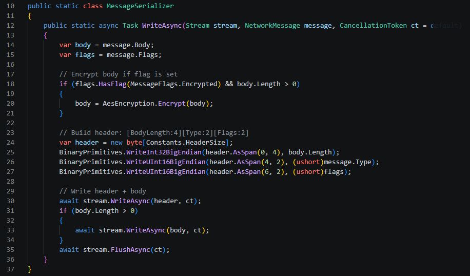

- Reader giải mã khi nhận:
src/TypeRacer.Shared/Protocol/MessageReader.cs
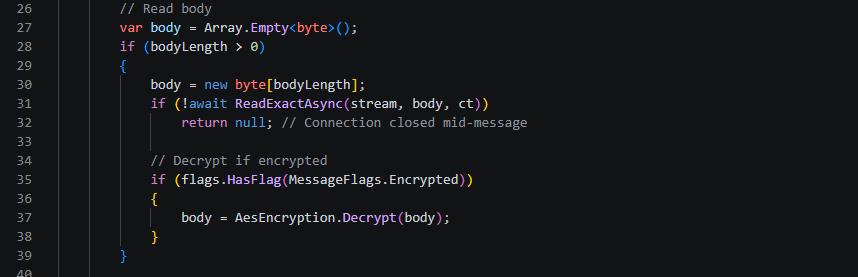

Thuật toán:
- `AES-256-CBC`
- random `IV` mỗi message

### 3.4 Bắt Wireshark việc gửi chat xem có mã hóa không

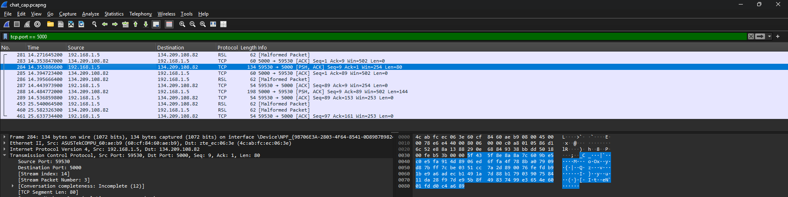

Luồng chính:

- `192.168.1.5:59530 -> 134.209.108.82:5000`

#### CHAT_SEND

Frame 281 là header: `00 00 00 50 01 90 00 01`

Giải mã:
- `BodyLength = 80`
- `Type = 0x0190 = 400 = CHAT_SEND`
- `Flags = 0x0001 = Encrypted`

Frame 284 là body 80 byte đã mã hóa:

```
5f435f8e8a8a7c609be5c0e5fa914d8906ed6ffa4f788ba07909d87bff7cbe0351cc7a2d890076fefdb91be9a6adecb1491a7d88b1790390758411da28f97de95b8f49837499e3654e6001fdd0c4a689
```

Kết luận: Không đọc được nội dung chat ở dạng text thường.

## 4. Demo mạng LAN

### 4.1 Cách chứng minh đang kết nối qua LAN

Host trên một máy tính 1:

IP private nội bộ lấy từ ipconfig `192.168.1.5:5000`
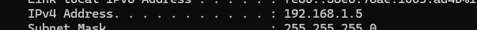

Ở máy 2 làm client, chọn chế độ Wifi/LAN, nhập chính xác ip trên
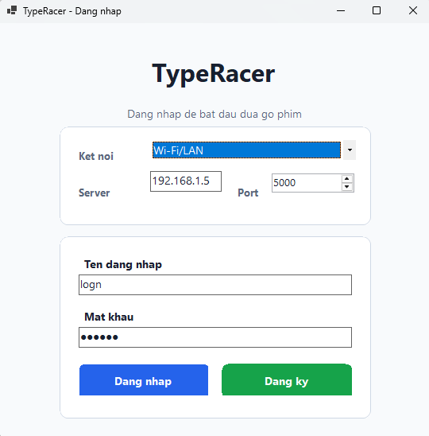
Kết quả là vào được game
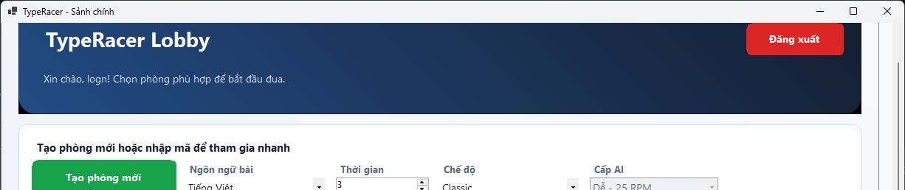

Kiểm tra trong cmd cho thấy server local đang listen ở máy host.
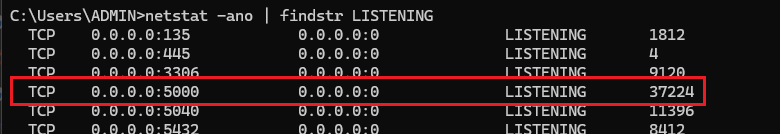
